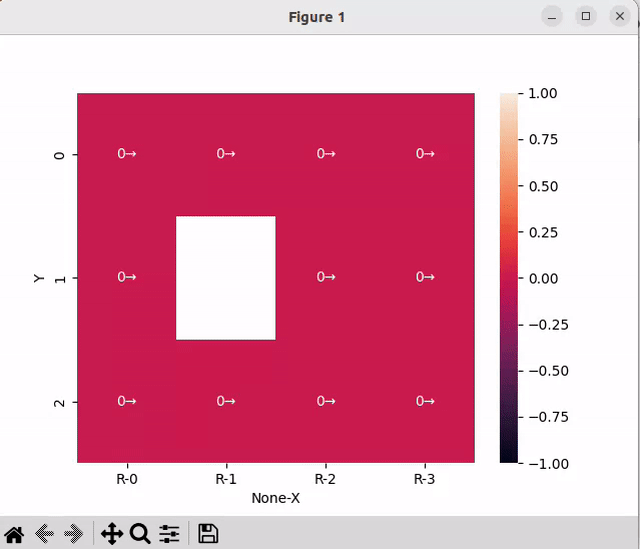
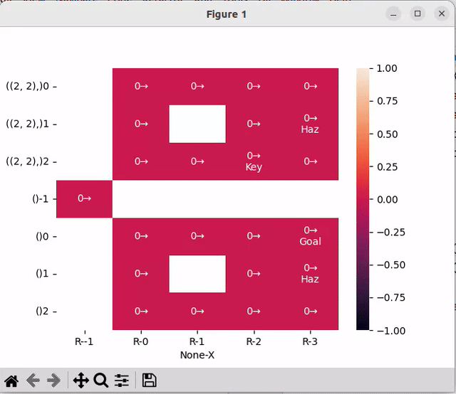

# Tutorial 07 - MDP with Value and Policy Iterations

Loosely based on the official solutions but adds tests and refactors each algo into a separate file.

The PI using linear algebra is done by subclassing the regular PolicyIteration class, 
rather than if conditions throughout the code. I will try to make it less cryptic if I have time later this week.

### Dependencies
Python 3.10 and only dependency is `numpy` and `seaborn`

    conda install numpy
    pip install seaborn

### Running
Use the `main.py` to just see the results with `-s solver` argument:

    python main.py -s value   // for value iteration

    # policy iteration will be disussed next week
    python main.py -s policy   // for policy iteration
    python main.py -s lin_alg   // for policy iteration using linear algebra

There are more commandline options:

    -i zero|random - initializer for the state values (unified random or zeros) 
    -d 0|1|2 - difficulty of the environment

To run the basic environment without keys:

    python main.py -s value

And you should see this:

To run the basic environment with key (same as in the tutorial sheet) use:

    python main.py -s value -d 1

You should see this:

The top grid is with key and the bottom grid has the states after the key has been collected.
You can see how in the top grid, the actions (indicated by the arrows) are trying to reach cell `2, 2` to reach the key
and in the bottom grid they are trying to reach the goal cell.

When the key cell in the top grid has been reached, the next state becomes the cell with the same coordinates, but in the bottom grid (i.e. the agent jumps from 2, 2 in the top to the 2, 2 in the bottom).

You can also try a more complicated environment:

    python main.py -s value -d 2

Which should result in this:

The key has been relocated to the bottom right corner of the top grid. The actions within the top grid continue to aim for the key, and they still aim for the `Goal` cell in the bottom grid. However, due to the increased number of steps required to attain the goal from the topmost positions, the impact of discounting becomes more evident. In both they also flow around the `Hazard` cells. This state values in significantly smaller for the top cells.
### Question 1
[q6-01.py](q6-01.py) has a solution to question 1 (markov chains).

    python q6-01.py

### More details
[Lecture by Andrew Ng](https://www.youtube.com/watch?v=d5gaWTo6kDM&t=3198s)
