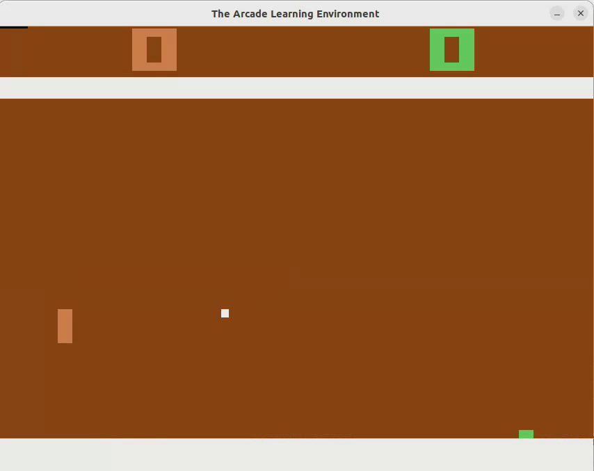
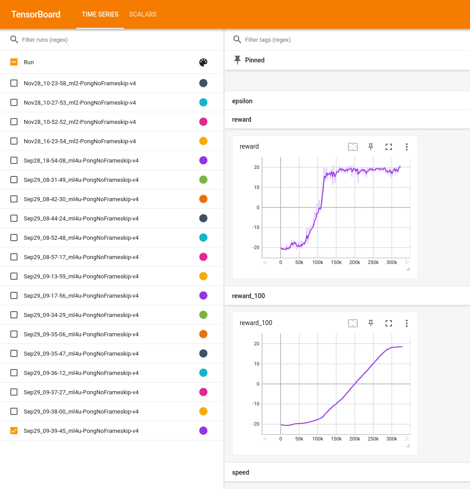

# Playing Pong with DQN

A simple implementation of the DQN for solving Pong. 

The code is based on chapter 6 from [Deep Reinforcement Learning Hands-On: Apply modern RL methods to practical problems of chatbots, robotics, discrete optimization, web automation, and more, 2nd Edition](https://www.amazon.com/Deep-Reinforcement-Learning-Hands-optimization/dp/1838826998/) but adds a DuellingDQN implementation, soft target updates and moves hyper-parameters to a config file.

### GPU
It's strongly recommended to run the training on a GPU as it will result in roughly double (~120FPS on NVIDIA RTX2080) speed compared to a CPU only training.

Using a GPU also requires [PyTorch with GPU support](https://pytorch.org/get-started/locally/). 

### Dependencies

There's quite a number of dependencies and some of them require an exact version to work. Some of the dependencies also require Python version 3.8, so I would recommend using [conda](https://docs.conda.io/projects/conda/en/latest/user-guide/tasks/manage-environments.html#create-env-from-file) to create a new environment and setup everything in that environment:

    conda create -n dqn-pong python=3.8

Once the environment is created, activate it and install everything:

    conda activate dqn-pong

__If you have an NVidia GPU, install Pytorch with CUDA support (if you have an AMD GPU, use the ROCM version):__

    pip3 install torch torchvision torchaudio --index-url https://download.pytorch.org/whl/cu118

For CPU only training:

    pip3 install torch torchvision torchaudio --index-url https://download.pytorch.org/whl/cpu

__Make sure you only install one - either the GPU or the CPU version!__

Now the rest of the dependencies:

    pip install gym==0.25 
    pip install gym[atari]==0.25
    pip install gym[accept-rom-license]==0.25
    pip install opencv-python
    pip install tensorboard six pyyaml

### Training
To start the training using the [Duelling DQN](https://arxiv.org/abs/1511.06581):

    python dqn_pong.py -n duelling-dqn 

You can also try [Double DQN](https://arxiv.org/abs/1509.06461):

    python dqn_pong.py -n double-dqn

Or just plain [DQN](https://arxiv.org/abs/1312.5602):

    python dqn_pong.py -n dqn

You should see the training log similar to this:

    882: done 1 games, R100 -20.000, R: -20.000, eps 0.99, speed 885.54 f/s
    1723: done 2 games, R100 -20.500, R: -21.000, eps 0.98, speed 1411.66 f/s
    2591: done 3 games, R100 -20.333, R: -20.000, eps 0.97, speed 1350.34 f/s
    3506: done 4 games, R100 -20.250, R: -20.000, eps 0.96, speed 1306.34 f/s
    4331: done 5 games, R100 -20.400, R: -21.000, eps 0.96, speed 1340.92 f/s
    5094: done 6 games, R100 -20.500, R: -21.000, eps 0.95, speed 1322.95 f/s
    5919: done 7 games, R100 -20.571, R: -21.000, eps 0.94, speed 1277.52 f/s
    6742: done 8 games, R100 -20.625, R: -21.000, eps 0.93, speed 1291.77 f/s
    7791: done 9 games, R100 -20.556, R: -20.000, eps 0.92, speed 1294.98 f/s
    8610: done 10 games, R100 -20.600, R: -21.000, eps 0.91, speed 1285.45 f/s
    9556: done 11 games, R100 -20.545, R: -20.000, eps 0.90, speed 1257.66 f/s
    10381: done 12 games, R100 -20.583, R: -21.000, eps 0.90, speed 183.38 f/s
    11322: done 13 games, R100 -20.615, R: -21.000, eps 0.89, speed 100.43 f/s
    12255: done 14 games, R100 -20.643, R: -21.000, eps 0.88, speed 100.20 f/s
    13078: done 15 games, R100 -20.667, R: -21.000, eps 0.87, speed 98.36 f/s
    14068: done 16 games, R100 -20.688, R: -21.000, eps 0.86, speed 98.61 f/s
    14994: done 17 games, R100 -20.706, R: -21.000, eps 0.85, speed 98.73 f/s

There is no training for first 10k frames so the FPS is quite high (~1.3k frames per sec) and it should go down to around 100 - 120.

The training will stop once (or if) the target R100 of 19.5 is reached. 

__It may take several hours to complete!__ Duelling DQN usually trains in about 600k frames, but it may take significantly longer!

### Tensorboard
While training, you can monitor the progress in [Tensorboard](https://www.tensorflow.org/tensorboard/get_started).

In a separate terminal, start the tensorboard (you will need to be in the project directory):

    tensorboard --logdir runs/

You should then see the instructions where the Tensorboard is served (usually http://localhost:6006). 
Open that URL in your browser and you should see something like this:

The values are tracked by using a `SummaryWriter` - see these lines in the [dqn_pong.py](dqn_pong.py):

            writer.add_scalar("epsilon", epsilon, frame_idx)
            writer.add_scalar("speed", speed, frame_idx)
            writer.add_scalar("reward_100", mean_reward, frame_idx)
            writer.add_scalar("reward", reward, frame_idx)

__This could be useful for the assignment report__

### Viewing the Trained Model
You can now see the trained model in action:

    python dqn_play.py -n duelling-dqn

And you should see your agent play.

